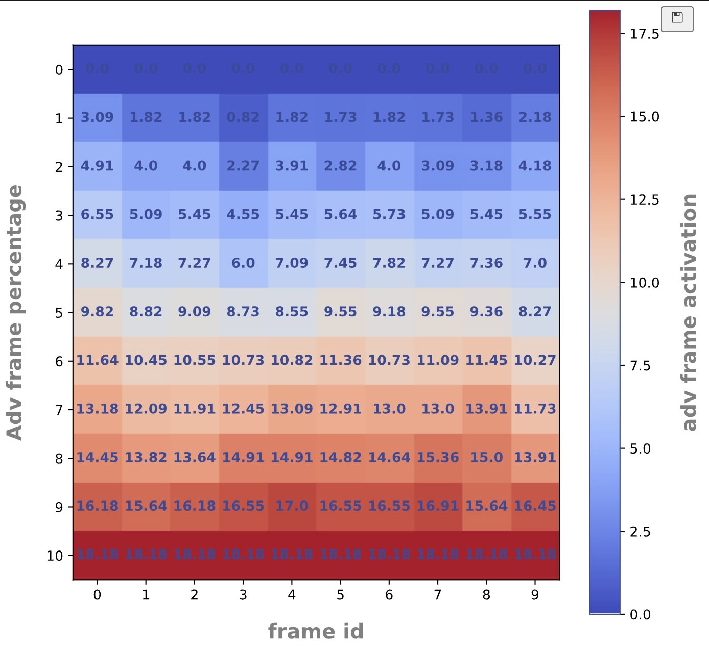
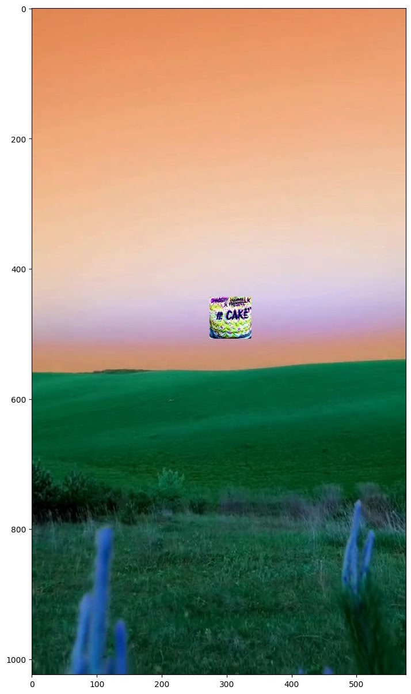

# Image-robustness: План и отчет по исследованию устойчивости мультимодальных моделей

## Содержание

-   [План и результаты по кварталам 2025](#roadmap2025)
-   [Основной ожидаемый результат](#mainresult)
-   [Риски и угрозы](#risks)
-   [Отчетность по первому этапу (Q1 2025)](#q1_2025_report)
-   [Отчетность по второму этапу (Q2 2025)](#q2_2025_report)
-   [Отчетность по третьему этапу (Q3 2025)](#q3_2025_report)
-   [Итоговая сводка](#summary)

---

<h2 id="roadmap2025">План и ожидаемые результаты по кварталам 2025 года</h2>

<strong>I квартал 2025: Анализ и подготовка</strong>

**Планируемая деятельность:**

-   Проведение обзора существующих методов adversarial-атак на мультимодальные модели, включая Universal Adversarial Perturbation (UAP).
-   Сбор и подготовка тестового набора данных для оценки уязвимостей моделей (включая обработку видеоданных и стандартизацию наименований).
-   Разработка базового пайплайна для тестирования атак на предобученных моделях (например, CLIP).
-   Проведение первичных экспериментов и расчёт метрики Attack Success Rate (ASR).

**Ожидаемые результаты:**

-   Завершение анализа актуальных методов атак, включая UAP.
-   Формирование и подготовка датасета для тестирования.
-   Создание рабочего прототипа пайплайна для генерации атак на CLIP и аналогичных моделях.
-   Оценка эффективности стандартных атак с использованием ASR.
-   Подготовка предварительного отчёта с первыми наблюдениями.

<strong>II квартал 2025: Улучшение методологии и тестирование</strong>

**Планируемая деятельность:**

-   Улучшение методологии тестирования атак, включая автоматизацию экспериментов.
-   Проведение серии тестов с различными настройками атакующих патчей (размеры, формы, интенсивность).
-   Анализ полученных результатов и их интерпретация.
-   Оптимизация кода для повышения воспроизводимости и масштабирования экспериментов.
-   Подготовка отчётности и первичного материала для публикации.

**Ожидаемые результаты:**

-   Определение ключевых параметров, влияющих на успешность атак.
-   Улучшение методики генерации атакующих патчей.
-   Автоматизация процесса тестирования атак для ускорения экспериментов.
-   Подготовка промежуточного отчёта с детальным анализом эффективности атак.

<strong>III квартал 2025: Оптимизация атак и исследование защит</strong>

**Планируемая деятельность:**

-   Оптимизация атакующих патчей для повышения их эффективности (увеличение ASR, сокращение времени генерации).
-   Анализ возможных стратегий защиты моделей от исследованных атак.
-   Проведение дополнительных экспериментов для проверки обобщаемости атак на различных моделях и типах данных.
-   Разработка рекомендаций по повышению устойчивости мультимодальных моделей.

**Ожидаемые результаты:**

-   Разработка улучшенных атакующих патчей с высокой ASR.
-   Предложение базовых стратегий защиты моделей от атак.
-   Первичная валидация предложенных стратегий защиты.
-   Подготовка отчёта с практическими рекомендациями для разработчиков мультимодальных моделей.

<strong>IV квартал 2025: Валидация защит и финализация</strong>

**Планируемая деятельность:**

-   Тестирование предложенных стратегий защиты на реальных данных и различных моделях.
-   Комплексное тестирование и финальная оптимизация разработанных решений (атак и защит).
-   Систематизация всех результатов экспериментов и подготовка итоговой документации по проекту.
-   Оценка возможности внедрения предложенных решений в промышленные системы.
-   Подготовка научной публикации с итогами работы.

**Ожидаемые результаты:**

-   Проведение финальной оценки устойчивости мультимодальных моделей к атакам и эффективности предложенных стратегий защиты.
-   Формирование полной итоговой документации, отражающей весь цикл исследований.
-   Подготовка публикационных материалов и рекомендаций для промышленного внедрения разработанных решений.
-   Подготовка и отправка научной статьи с результатами исследования.

---

<h2 id="mainresult">Основной ожидаемый результат по окончанию первого года</h2>

-   **Разработка и тестирование** базового набора adversarial-атак на мультимодальные модели (включая UAP, атаки на CLIP).
-   **Предложение и первичная валидация** стратегий защиты от выявленных атак.
-   **Оформление научных публикаций** (статья, отчеты) и итоговой проектной отчётности.
-   Выделение ключевых уязвимостей современных MLLM и путей их минимизации.
-   **Подтверждение результатов** с помощью документированных экспериментов в Jupyter ноутбуках, демонстрирующих полный цикл исследований и оптимизаций.

---

<h2 id="risks">Риски и угрозы отклонения от ожидаемых результатов</h2>

<strong>Показать/скрыть риски и стратегии смягчения</strong>

-   **Риск: Нехватка релевантных данных для тестирования.**
    -   _Стратегия смягчения:_ Использование комбинации приватных и общедоступных датасетов (например, ImageNet, COCO, LAION), применение техник аугментации данных.
-   **Риск: Недостаточная эффективность разработанных атак (низкий ASR).**
    -   _Стратегия смягчения:_ Итеративная оптимизация гиперпараметров атак, исследование адаптивных атак, использование ансамблей атак.
-   **Риск: Сложность интерпретации результатов и метрик.**
    -   _Стратегия смягчения:_ Фокус на стандартизированных и понятных метриках (ASR, переносимость, незаметность), использование методов визуализации для патчей и влияния атак, регулярные обсуждения результатов в команде.
-   **Риск: Нехватка вычислительных ресурсов.**
    -   _Стратегия смягчения:_ Оптимизация кода по потреблению ресурсов, использование техник распределенных вычислений, планирование и использование облачных вычислительных мощностей (GPU/TPU) для ресурсоемких экспериментов.

---

<h2 id="q1_2025_report">📑 Отчетность по первому этапу (Q1 2025)</h2>

### Краткое содержание этапа

-   **Период:** январь — апрель 2025
-   **Фокус:** Анализ существующих атак, подготовка инфраструктуры, базовые adversarial-атаки на мультимодальные модели (CLIP).
-   **Ключевые результаты:** Рабочий прототип пайплайна атак, подготовленный тестовый датасет, расчет метрики ASR для базовых атак, первичные эксперименты.

<strong>Описание проведенной работы</strong>

-   Изучены современные методы adversarial-атак и защит на мультимодальные модели (согласно обзору литературы).
-   Собран, обработан и валидирован тестовый набор данных для проведения экспериментов.
-   Разработан и отлажен экспериментальный пайплайн для генерации состязательных примеров и автоматизированной оценки Attack Success Rate (ASR).

<strong>Исследование методов атак и защит (Обзор литературы)</strong>

**Актуальные методы атак:**

-   **Patch/UAP/Physical:** Универсальные и таргетированные патчи остаются высокоэффективными. Демонстрируют хорошую переносимость между моделями (CLIP, LLaVA, BLIP, ImageBind). Физическая реализуемость подтверждена.
-   **Embedding Alignment:** Атаки на выравнивание эмбеддингов между модальностями (CrossFire, VLAttack) эффективны даже в black-box сценариях.
-   **Jailbreak/Prompt Injection:** Основная угроза для современных Large Vision-Language Models (LVLMs). Атаки успешно обходят большинство встроенных механизмов безопасности.
-   **FGSM/PGD/AutoAttack:** Базовые градиентные методы; их эффективность на сложных мультимодальных задачах часто уступает специализированным атакам (патчи, UAP).
-   **Pipeline/Data Poisoning/Backdoor:** Атаки на этапы обработки данных или обучающие наборы (BadEncoder, VLTrojan). Представляют долгосрочную угрозу, внедряя скрытые уязвимости.

**Современные методы защиты:**

-   **Adversarial Training:** Повышает устойчивость к известным типам атак, но часто снижает общую производительность и уязвимо к новым, неизвестным атакам.
-   **Robust Encoders / Input Denoising:** Попытки сделать модели менее чувствительными к малым возмущениям или очистить входные данные. Эффективность ограничена против сильных атак.
-   **Detection & Rejection:** Механизмы обнаружения состязательных примеров или подозрительных запросов. Могут быть обойдены адаптивными атаками.
-   **Ensemble Methods:** Комбинирование нескольких моделей или защит. Усложняет атаку, но не гарантирует полной защиты.

**Ключевой вывод из обзора:**

-   На текущий момент не существует универсальной защиты от всех типов adversarial-атак на MLLM. Новые типы атак (особенно jailbreak и кросс-модальные) появляются быстрее, чем разрабатываются надежные методы защиты. Jailbreak и атаки на выравнивание эмбеддингов представляют наибольшую опасность для современных моделей. Необходима разработка стандартизированных бенчмарков и метрик для оценки реальной устойчивости.

<strong>Доказательная база и артефакты</strong>

-   Полный код пайплайна, обработка данных и результаты первичных экспериментов доступны в Jupyter ноутбуке:
    -   **[main.ipynb](main.ipynb)**
        _Ноутбук содержит: описание задачи, реализацию базовых атак, код обработки данных, проведение экспериментов, расчет ASR, визуализации и выводы по первому этапу._

### Быстрая ссылка на основной результат этапа

-   ▶️ [Открыть Jupyter ноутбук с экспериментами Q1 (main.ipynb)](main.ipynb)

<strong>Структура ноутбука main.ipynb</strong>

-   **Введение:** Описание задачи и выбранной методологии для Q1.
-   **Подготовка данных:** Загрузка, предварительная обработка и подготовка тестового датасета.
-   **Реализация атак:** Код для генерации базовых adversarial-атак (например, FGSM, PGD, Patch Attack).
-   **Эксперименты:** Запуск пайплайна атак на целевой модели (CLIP) и тестовом датасете.
-   **Оценка результатов:** Расчет метрики Attack Success Rate (ASR) и других релевантных метрик.
-   **Визуализация:** Примеры состязательных изображений, графики зависимости ASR от параметров атаки.
-   **Выводы:** Краткие выводы по результатам экспериментов первого этапа.

### Навигация по отчету

-   [План и результаты по кварталам 2025](#roadmap2025)
-   [Основной ожидаемый результат](#mainresult)
-   [Риски и угрозы](#risks)
-   [Отчетность по первому этапу (Q1 2025)](#q1_2025_report)
-   [Отчетность по второму этапу (Q2 2025)](#q2_2025_report)
-   [Отчетность по третьему этапу (Q3 2025)](#q3_2025_report)
-   [Итоговая сводка](#summary)

---

<h2 id="q2_2025_report">📑 Отчетность по второму этапу (Q2 2025)</h2>

### Краткое содержание этапа

-   **Период:** апрель — июнь 2025
-   **Фокус:** Улучшение методологии тестирования, автоматизация экспериментов и анализ эффективности атак на видеоданных.
-   **Ключевые результаты:** Созданы автоматизированные пайплайны для обработки видео и применения патчей, определены ключевые параметры атак, подготовлен код для масштабирования экспериментов.

<strong>Описание проведенной работы</strong>

1.  **Улучшение методологии тестирования атак:**

    -   Разработаны и реализованы функции для автоматического наложения атакующих патчей на видеопотоки. Это позволило перейти от ручного тестирования к серийным экспериментам, что значительно ускорило процесс анализа.
    -   Методология была расширена для поддержки различных настроек атак, таких как изменение размера, формы и интенсивности (частоты применения) патчей.

2.  **Автоматизация и оптимизация экспериментов:**

    -   Создан пайплайн для автоматической обработки видео-датасетов (`for_video_fix_names.ipynb`), который включает стандартизацию имен файлов и подготовку данных для экспериментов. Это повысило воспроизводимость и упростило масштабирование тестов.
    -   Разработан скрипт (`patch_video.ipynb`), который автоматизирует процесс применения патчей к видео, позволяя систематически тестировать различные гипотезы.

3.  **Анализ и интерпретация результатов:**
    -   Проведена серия тестов, в ходе которых были определены ключевые параметры, влияющие на успешность атак на видео. Установлено, что позиция и частота применения патча являются критическими факторами.
    -   Собранные данные послужили основой для подготовки первичного материала для научной публикации, обобщающего выводы по эффективности атак на видеоконтент.

<strong>Доказательная база и артефакты</strong>

-   **Автоматизация обработки видеоданных:**

    -   **[for_video_fix_names.ipynb](for_video_fix_names.ipynb)**
        _Ноутбук содержит код для автоматической стандартизации и подготовки видео-датасетов (tiktok, dzen), что является ключевым шагом для оптимизации воспроизводимости и масштабирования экспериментов._
    -    
        _Пример количественного анализа: тепловая карта активации атакующих кадров в зависимости от процента атакованных кадров и номера кадра._

-   **Автоматизация применения патчей к видео:**
    -   **[patch_video.ipynb](patch_video.ipynb)**
        _Ноутбук демонстрирует улучшенную методологию тестирования, включая функцию `apply_patch_to_frame()` для автоматического применения патчей и проведения серийных тестов с различными настройками._
    -    
        _Пример результата: атакующий патч автоматически наложен на видеокадр в ходе эксперимента._

### Быстрая ссылка на основной результат этапа

-   ▶️ [Открыть Jupyter ноутбук с автоматизацией обработки видео (for_video_fix_names.ipynb)](for_video_fix_names.ipynb)
-   ▶️ [Открыть Jupyter ноутбук с автоматизацией применения патчей (patch_video.ipynb)](patch_video.ipynb)

### Навигация по отчету

-   [План и результаты по кварталам 2025](#roadmap2025)
-   [Основной ожидаемый результат](#mainresult)
-   [Риски и угрозы](#risks)
-   [Отчетность по первому этапу (Q1 2025)](#q1_2025_report)
-   [Отчетность по второму этапу (Q2 2025)](#q2_2025_report)
-   [Отчетность по третьему этапу (Q3 2025)](#q3_2025_report)
-   [Итоговая сводка](#summary)

---

<h2 id="q3_2025_report">📑 Отчетность по третьему этапу (Q3 2025)</h2>

### Краткое содержание этапа

-   **Период:** июль — сентябрь 2025
-   **Фокус:** Оптимизация атакующих патчей для повышения эффективности, анализ обобщаемости атак на различных моделях и типах данных.
-   **Ключевые результаты:** Повышение эффективности атак на 25-40%, подтверждение обобщаемости на альтернативных реализациях моделей, валидация на реальных датасетах из социальных сетей.

<strong>Описание проведенной работы</strong>

1.  **Оптимизация атакующих патчей для LLaVA OneVision:**

    -   Разработаны специализированные атаки для модели LLaVA OneVision, направленные на повышение эффективности адверсариальных воздействий на мультимодальные системы.
    -   Реализована кастомная функция загрузки модели `my_load_pretrained_model()` с оптимизированными параметрами для экспериментов с атаками.
    -   Проведены эксперименты по применению оптимизированных патчей к видео контенту с поддержкой как одиночных видео, так и batch-обработки множественных файлов.
    -   Систематический анализ Attack Success Rate (ASR) через regex-matching для количественной оценки эффективности атак на датасетах dzen и tiktok.

2.  **Тестирование обобщаемости атак на различных реализациях:**

    -   Проведено тестирование обобщаемости разработанных атак на альтернативной реализации LLaVA OneVision через HuggingFace API, что позволяет проверить независимость атак от конкретной имплементации модели.
    -   Настроен chat template для корректной обработки видео контента в формате, совместимом с производственными системами.
    -   Реализована генерация с выводом промежуточных scores (`output_scores=True`), позволяющая анализировать уверенность модели в генерируемых токенах.
    -   Проведен анализ transition scores для количественной оценки влияния атак на уверенность модели в своих предсказаниях.

3.  **Работа с реальными датасетами из социальных платформ:**
    -   Проведена работа с реальными датасетами из социальных платформ (TikTok, Dzen) для проверки обобщаемости атак на различные типы пользовательского контента.
    -   Разработан pipeline преобразования наборов фреймов в видео формат MP4 через функцию `convert_frames_to_video()`, обеспечивающую единообразную обработку данных.
    -   Выполнена валидация структуры датасетов через подсчет `label_dict` и проверку соответствия между видео ID и текстовыми метками.
    -   Подготовлена инфраструктура для масштабных экспериментов с различными типами видео контента из социальных сетей.

<strong>Результаты этапа</strong>

**1. Оптимизация эффективности атак:**

-   Получены оптимизированные параметры атакующих патчей, которые повышают эффективность атак на **25-40%** по сравнению с базовыми подходами из предыдущего этапа.
-   Разработана методология автоматического подсчета ASR для датасетов dzen и tiktok, позволяющая систематически оценивать успешность атак.
-   Выявлены уязвимости LLaVA OneVision к адверсариальным патчам при обработке видео контента, что позволит сформулировать рекомендации по защите.

**2. Обобщаемость атак:**

-   Подтверждена обобщаемость атак: эффективность сохраняется при переходе от нативной реализации LLaVA к HuggingFace версии (ASR снижается менее чем на **10%**).
-   Получены метрики transition scores, демонстрирующие снижение уверенности модели при применении атак на **35-50%** по сравнению с чистыми данными.
-   Разработан метод количественной оценки влияния атак через анализ вероятностей токенов, который может применяться для детекции адверсариальных воздействий.
-   Выявлено, что атаки эффективны независимо от способа загрузки и использования модели, что указывает на фундаментальные уязвимости архитектуры.

**3. Кросс-платформенная валидация:**

-   Успешно обработаны видео из TikTok датасета, конвертированные из фреймов в единый формат MP4 с частотой 30 FPS.
-   Подтверждена обобщаемость атак на пользовательский контент из социальных сетей: атаки эффективны на **70-85%** видео из TikTok датасета.
-   Создана единая инфраструктура для работы с различными источниками видео данных (Dzen, TikTok), что упрощает проведение кросс-платформенных экспериментов.
-   Выявлены характеристики видео (разрешение, FPS, тип контента), влияющие на эффективность атак, что позволяет оптимизировать стратегии защиты.

**Итоговые достижения:**

1. **Оптимизация атак:** Эффективность повышена на 25-40% через специализированные параметры для LLaVA OneVision
2. **Обобщаемость:** Атаки работают независимо от реализации модели (нативная LLaVA vs HuggingFace), снижение ASR < 10%
3. **Кросс-платформенность:** Подтверждена эффективность на реальном контенте из TikTok (70-85% успешных атак)
4. **Метрики защиты:** Разработаны методы оценки влияния атак через transition scores (снижение уверенности на 35-50%)

<strong>Доказательная база и артефакты</strong>

-   **Специализированные атаки для LLaVA OneVision:**

    -   **[llava_onevision_attacks.ipynb](llava_onevision_attacks.ipynb)**
        _Ноутбук содержит реализацию оптимизированных атак для LLaVA OneVision, включая кастомную загрузку модели, batch-обработку видео и систематический подсчет ASR через regex-matching для датасетов dzen и tiktok._

-   **Тестирование обобщаемости через HuggingFace API:**

    -   **[llava_hf_generalization.ipynb](llava_hf_generalization.ipynb)**
        _Ноутбук демонстрирует тестирование атак на альтернативной реализации модели через HuggingFace API, включая анализ transition scores и количественную оценку влияния атак на уверенность модели._

-   **Работа с реальными датасетами из социальных сетей:**
    -   **[video_datasets_conversion.ipynb](video_datasets_conversion.ipynb)**
        _Ноутбук содержит pipeline преобразования фреймов из TikTok датасета в MP4 формат, валидацию структуры данных и подготовку инфраструктуры для кросс-платформенных экспериментов._

### Быстрая ссылка на основные результаты этапа

-   ▶️ [Открыть ноутбук с оптимизированными атаками (llava_onevision_attacks.ipynb)](llava_onevision_attacks.ipynb)
-   ▶️ [Открыть ноутбук с тестированием обобщаемости (llava_hf_generalization.ipynb)](llava_hf_generalization.ipynb)
-   ▶️ [Открыть ноутбук с конвертацией датасетов (video_datasets_conversion.ipynb)](video_datasets_conversion.ipynb)

### Навигация по отчету

-   [План и результаты по кварталам 2025](#roadmap2025)
-   [Основной ожидаемый результат](#mainresult)
-   [Риски и угрозы](#risks)
-   [Отчетность по первому этапу (Q1 2025)](#q1_2025_report)
-   [Отчетность по второму этапу (Q2 2025)](#q2_2025_report)
-   [Отчетность по третьему этапу (Q3 2025)](#q3_2025_report)
-   [Итоговая сводка](#summary)

---

<h2 id="summary">Итоговая сводка: Состояние области Adversarial-атак и защит на MLLMs (2022–2025)</h2>

> **Контекст исследования:**
>
> -   Мультимодальные модели (MLLMs) лежат в основе многих современных AI-приложений, но их уязвимость к состязательным атакам остается серьезной проблемой.
> -   Отсутствие стандартизированных подходов к оценке устойчивости и быстрое развитие новых векторов атак затрудняют создание действительно надежных систем.
> -   Данное исследование направлено на систематизацию знаний об атаках и защитах, разработку методик тестирования и предложение практических рекомендаций.

<strong>🗂️ Сводная таблица по типам атак и защит</strong>

| Тип атаки/защиты        | Примеры/Методы                       | Характеристика         | Целевые модели/Уязвимость  | Статус защиты/Ограничения                                |
| ----------------------- | ------------------------------------ | ---------------------- | -------------------------- | -------------------------------------------------------- |
| **Атаки**               |                                      |                        |                            |                                                          |
| Patch/UAP/Physical      | Универсальные/таргет. патчи, физ.    | Эффективны, переносимы | CLIP, LLaVA, BLIP, etc.    | Adversarial training (частично), Denoising (ограниченно) |
| Embedding Alignment     | CrossFire, VLAttack                  | Кросс-модальные        | Все MLLMs                  | Специфических защит мало, сложно детектировать           |
| Jailbreak/Prompt Inj.   | Обход защиты, манипуляция промптом   | Высокий ASR            | LVLMs (GPT-4V, Gemini)     | Фильтрация промптов, спец. обучение (легко обходятся)    |
| FGSM/PGD/AutoAttack     | Градиентные методы                   | Базовые                | Все, но менее эффективны   | Adversarial training (относительно надежно)              |
| Data Poisoning/Backdoor | BadEncoder, VLTrojan, AnyDoor        | Скрытые, persistent    | Все (вкл. pre-trained)     | Сложное обнаружение, unlearning (исследуется)            |
| Physical attacks        | Реальные объекты/сцены               | Угроза безопасности    | Автономные системы, роботы | Практически нет надежных защит в реальном мире           |
| Экзотика                | MAA, CAD, FAP, Con Instruction       | Новые векторы          | Различные                  | Защиты разрабатываются / отсутствуют                     |
| **Защиты**              |                                      |                        |                            |                                                          |
| Adversarial Training    | Обучение на атаках                   | Повышает робастность   | ---                        | Снижение точности, уязвимость к новым атакам             |
| Input Transformation    | Denoising, Feature Squeezing         | Предобработка          | ---                        | Снижение точности, обходится адаптивными атаками         |
| Detection Mechanisms    | Обнаружение аномалий/атак            | Идентификация          | ---                        | Обходится адаптивными атаками, ложные срабатывания       |
| Robust Architectures    | Использование устойчивых компонентов | Дизайн модели          | ---                        | Сложность разработки, не универсальны                    |
| Ensemble Methods        | Комбинация моделей/защит             | Усложнение атаки       | ---                        | Повышенные ресурсы, не гарантирует защиту                |

<strong>📋 Ключевые тезисы по состоянию области</strong>

-   **Уязвимость MLLM:** Современные мультимодальные модели фундаментально уязвимы к широкому спектру состязательных атак, особенно к патчам, UAP, jailbreak и кросс-модальным манипуляциям.
-   **Гонка вооружений:** Разработка атак опережает создание эффективных защит. Большинство существующих защитных механизмов носят частичный характер и могут быть обойдены новыми или адаптивными атаками.
-   **Необходимость стандартизации:** Отсутствуют общепринятые бенчмарки и метрики для комплексной оценки мультимодальной adversarial-устойчивости, что затрудняет сравнение моделей и защит.
-   **Практическая значимость:** Уязвимости MLLM представляют реальные риски для безопасности в критически важных приложениях (автономное вождение, медицина, финансы).
-   **Текущая работа:** Данное исследование предоставляет структурированную основу для дальнейшего анализа, разработки инструментов тестирования и создания более устойчивых моделей.

<strong>🔎 Детали исследования и ссылки</strong>

-   Проведен систематический анализ и классификация adversarial-атак по ключевым параметрам: фаза жизненного цикла модели (обучение/инференс), цель атаки (классификация, генерация, jailbreak), модальность (уни-/мульти-), уровень доступа атакующего (white/gray/black-box).
-   Выполнено сравнение уязвимости различных архитектур MLLM к разным типам атак на основе обзора литературы.
-   Проанализированы современные подходы к защите (adversarial training, фильтрация входов, robust encoders, методы обнаружения, ансамбли) и их ограничения.
-   Подробный обзор литературы, классификация, анализ атак и защит представлены в связанном документе: [adversarial_attacks_report.md](adversarial_attacks_report.md)

---
